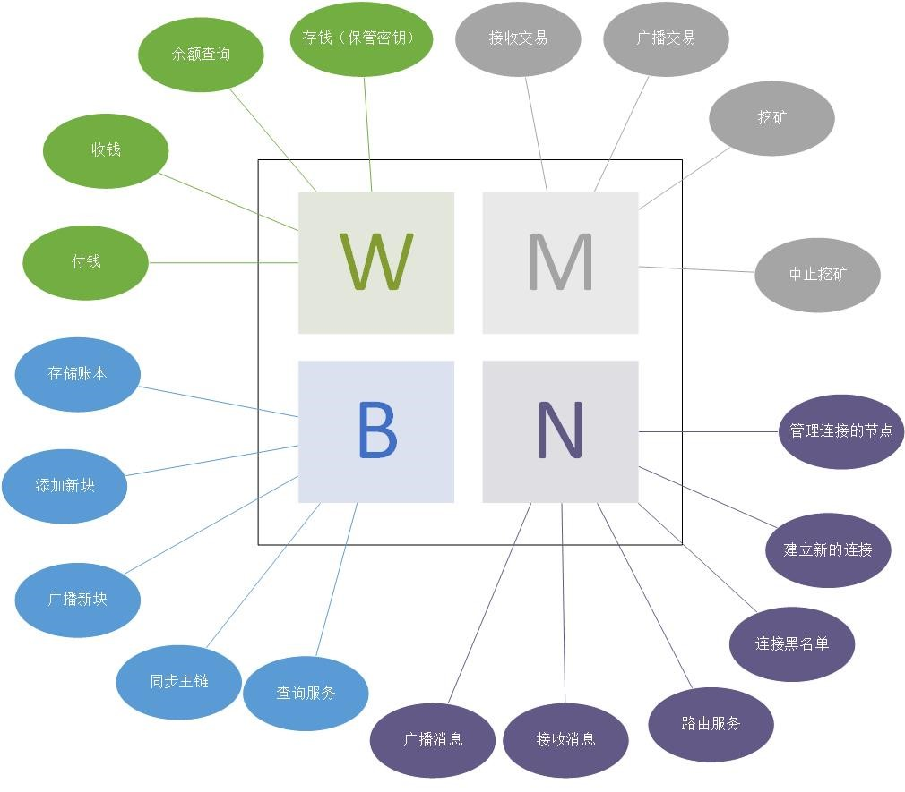

# 网络中的节点

## 一个全节点包括4个功能：

W - 钱包	M - 矿工	B - 完整的区块链数据库	N - 网络路由




## 各功能之间的依赖关系


## 消息传递

> 4个功能设计为4个服务，采用消息队列的方式以避免线程同步问题。

### N

> 接收方-类型-指令-数据
>
> *N-GET--															# 返回自身连接的节点
>
> *N-PUT--{msg消息}											# 广播msg消息

### B

> 接收方-类型-指令-数据
>
> B-PUT-BLOCK-{block的序列信息}								# 添加新块，然后广播
>
> *B-GET-UTXO-[多个地址的序列信息]				# 返回这些地址的多个utxo 
>
> *B-GET-BALANCE-[多个地址的序列信息]			# 返回这些地址的余额
>
> *B-GET-HASH-														# 返回区块链的hash值
>
> *B-GET-HEIGHT-													# 返回区块链的高度
>
> *B-GET-BLOCK-{block的index}							# 返回指定索引位置的区块

### W


### M

> M-PUT-TRANS-{transaction的序列信息}					# 添加交易，广播交易
>
> M-PUT-BLOCK-{block的序列消息}								# 被其它节点先挖到了
>
> *M-PUT-{block的序列信息}								# 暂停挖矿，开始新一轮挖矿
>
> *M-GET-STOP														# 停止挖矿
>
> *M-RESPONSE--{}


## 持久化存储

### W-存储秘钥

存储位置："./files/user.keys" 文件，一行一个秘钥

当程序启动时自动导入，程序关闭时自动导出

### F-存储区块链

存储位置："./files/blockchain.db" 文件，使用sqlite管理

sqlite表格设计：

```sqlite
CREATE TABLE blockchain (
	"index" INTEGER NOT NULL primary key,	/* 区块索引 */
	block INTEGER NOT NULL					/* 区块的str形式 */
);
```


